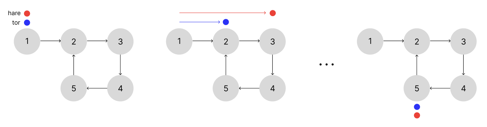

자료구조, 알고리즘 공부를 코테문제풀이랑 같이 시작해서 그런지 모르는 개념이 너무 많다... 이 문제도 2, 3시간 고민하다가 결국 해설을 참고했는데 잊어버리면 안 될 것 같아서 정리해본다ㅠ

# 문제 해설
[141. Linked List Cycle](https://leetcode.com/problems/linked-list-cycle/description/)

**head가 주어지면 연결리스트에 사이클이 존재하는지 확인하는 문제**
- `next` 포인터를 계속 따라갔을 때 자기 자신에게 다시 도달할 수 있는 노드가 있다면 사이클이 있는 것
- `pos` 는 매개변수로 전달되지 않음(단순히 문제 설명을 위한 요소)
- 연결리스트에 사이클이 있으면 `true`를 반환하고, 없으면 `false`를 반환

# 문제 풀이

- 토끼와 거북이 알고리즘(Tortoise and Hare Algorithm)

플로이드의 토끼와 거북이 알고리즘은 연결리스트에 사이클이 있는지를 확인할 수 있는 방법으로 유명하다. 

1. `tor`, `hare`의 시작점은 연결리스트의 `head`이고, 각각 한 칸씩, 두 칸씩 이동한다. 
2. `tor`가 `hare`가 만나는 지점이 있다면 사이클이 있는 것이다. 

이때 확인해야 것이 있다. 주어지는 `head`가 `null`인지, `head.next`가 `null`인지 확인하는 것이다. `head`가 `null`이라면 애초에 연결리스트가 성립될 수 없고, `head.next`가 `null`이라면 사이클이 없는 단순 연결리스트가 된다. 



그림으로 보면 이렇게 된다. 두 점의 시작점은 `head` 노드이고, 이동하다가 언젠가 만나는 순간이 온다면 사이클이 있는 것이므로 `true`를 반환한다. 

# 코드

```js
var hasCycle = function (head) {
    // tor, hare의 시작점은 head 노드이다
    let tor = head;
    let hare = head;

    //head를 hare에 할당했으므로 hare이 null이 아니고, hare.next도 null이 아닌 동안 안의 코드를 반복
    while (hare && hare.next) {
        //tor은 한 칸씩 이동
        tor = tor.next;
        //hare은 두 칸씩 이동
        hare = hare.next.next;
        //만약 둘이 만난다면 사이클이 있으므로 true를 반환
        if (tor === hare) {
            return true;
        }
    }

    //만나지 않으면 false를 반환
    return false;
};
```

# 문제를 풀면서 했던 오해들...

### 1. head는 배열?

문제를 보면 예시를 `Input: head = [3,2,0,-4]` 이런 식으로 들었다. 나는 이걸 보고 바보처럼 `head`가 배열이라고 생각하고 문제를 풀었다ㅋㅋㅋ... 삽질을 거하게 했던 것...

이런 표기법은 연결 리스트 예시를 보여주기에 쉬운 방법이라서 사용된다고 한다. 따라서
```plaintext
head -> [3] -> [2] -> [0] -> [-4] -> null
```
이렇게 해석하면 된다. 

### 2. pos는 어디에...

위와 비슷하게 예시 Input을 보면 `head`와 함께 `pos`가 주어진다. `Input: head = [3,2,0,-4], pos = 1` 이런 식으로 말이다. 

이 pos를 사용하려고 온갖 방법을 생각해봤는데 결국에는 해결하지 못했다ㅎ... 알고 보니 이 `pos`도 단순히 문제 설명을 위해 사용되는 개념이라고...! 그래서 코드에 사용할 필요가 없었다. 

### 3. `TypeError: Cannot read property 'next' of null`

해설을 참고해서 처음 코드를 짰을 때 나는 
```js
var hasCycle = function(head){
    let tor = head;
    let hare = head;

    while (hare.next !== null){
        tor = tor.next;
        hare = hare.next.next;
        if(tor === hare){
            return true;
        }
    }
    return false;
}
``` 
이런 식으로 짰었다. 그렇게 `TypeError: Cannot read property 'next' of null` 라는 타입에러를 마주했다. 

> TypeError란?
> 값이 기대하던 자료형이 아니라서 연산이 불가능 할 때 발생한다.
> - 함수에 전달된 피연산자 또는 인수가 해당 연산자나 함수가 예상하는 타입과 호환되지 않을 경우
> - 변경할 수 없는 값을 수정하려고 할 경우
> - 부적절한 방법으로 값을 사용하려고 할 경우
> [mdn web docs](https://developer.mozilla.org/ko/docs/Web/JavaScript/Reference/Global_Objects/TypeError)

문제가 발생했던 부분은 `while (hare.next !== null)` 이 부분이었다. 여기서 내가 고려하지 않았던 건 주어지는 head가 null일 수 있다는 점이었다. 

`while (hare.next !== null)` 이렇게 코드를 작성하면 처음부터 `hare`가 `null`일 수 없음을 가정하고 while문을 실행하게 된다. `null`은 `next` 포인터를 가질 수 없으니까! 

그래서 에러에서도 `null`의 `next` 프로퍼티를 읽을 수 없다고 하고 있다. 


---

이렇게 연결리스트 문제를 풀어보았다. 자료구조랑 알고리즘 공부를 더 열심히 하고, 코테문제도 많이 접해봐야겠다🥲 
